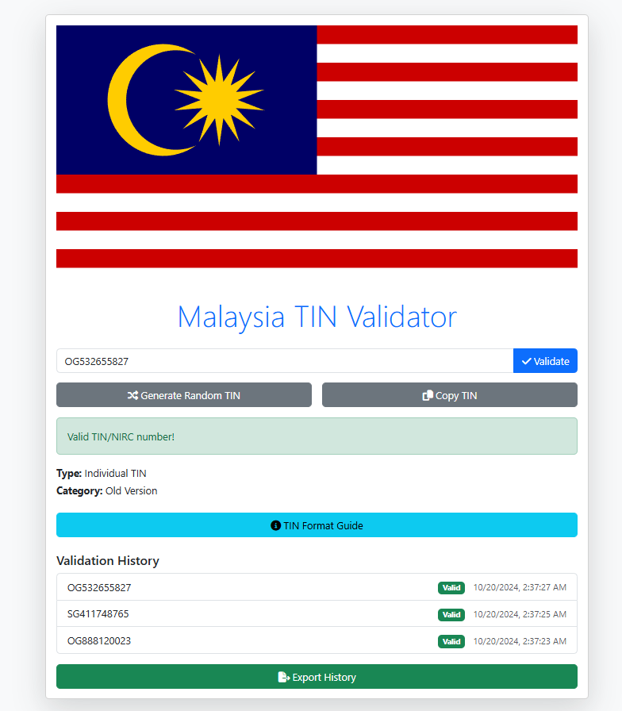

# Malaysia TIN Validator

A web-based tool for validating Malaysian Tax Identification Numbers (TIN) and National Registration Identity Card (NIRC) numbers.

## Features

- Validate individual TINs (new and old versions)
- Validate non-individual TINs (new and old versions)
- Support for general TINs
- Generate random valid TINs
- Bulk validation
- Validation history with export functionality
- Statistics on validation results

## Usage

1. Open `index.html` in a web browser.
2. Enter a TIN or NIRC number in the input field.
3. Click "Validate" or press Enter to check the validity.
4. Use additional features like random TIN generation, bulk validation, and history export as needed.

## Technical Details

- Built with HTML, CSS (Bootstrap 5), and vanilla JavaScript.
- No server-side components required.

## Contributing

Contributions are welcome! Please feel free to submit a Pull Request.

## Credits

Contributed by Min Myat Oo (minmyatoo.dev@gmail.com)

## License

This project is open source and available under the [MIT License](LICENSE).